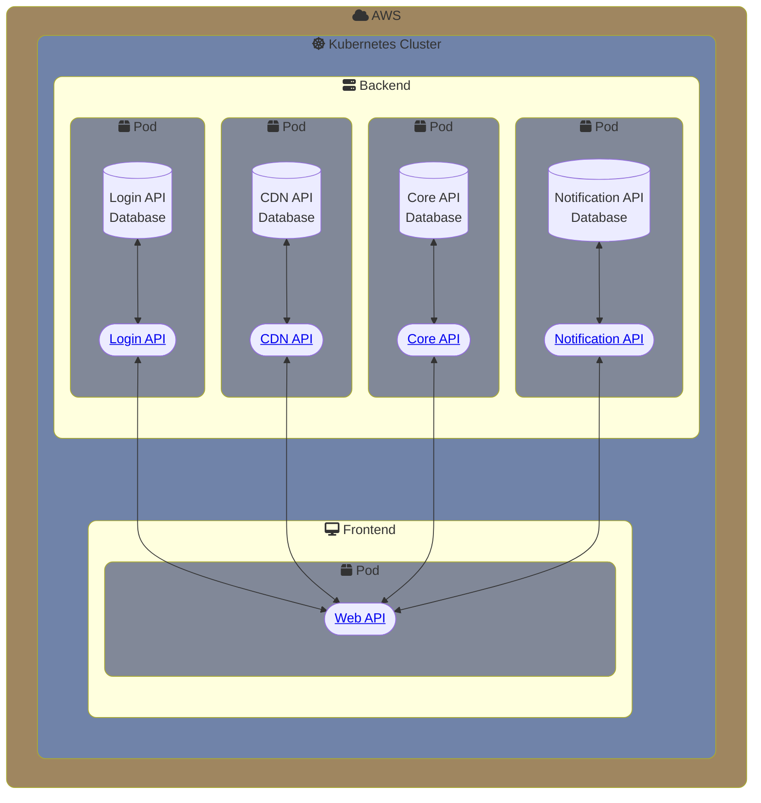

# Cancer Classification UI Github
[![Python][Python-badge]][Python-url]
[![Go][Go-badge]][Go-url]

This is the organization github page for a Cancer Classification UI. This contains all the our current codebases for our Frontend and Backend.

Dive into any of our current repos!

# Current Architecture (WIP)

<!-- MARKDOWN LINKS & IMAGES -->
[Go-badge]: https://img.shields.io/badge/Go-00ADD8.svg?style=for-the-badge&logo=go&logoColor=white
[Go-url]: https://go.dev/
[Python-badge]: https://img.shields.io/badge/Python-3776AB.svg?style=for-the-badge&logo=python&logoColor=FFD343
[Python-url]: https://www.python.org/
